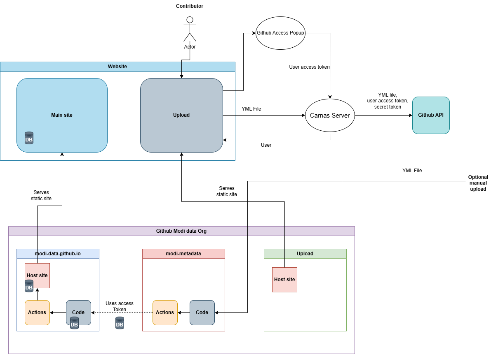

# How to upload metadata

### Introduction
This repository contains all the metadata files on the [platform](https://modi-data.github.io/).\
[MODI](https://modiproject.eu/) parteners can upload their metadata files here.
These files will automatically be uploaded to the platform.
Other users can then search for these files and in the end use them find and use the right datasets for their research.

To upload to this repository you first need to become a **contributor**.

### Becoming a contributor
Send an email to **TEMP NAME**.\
State what organization you are from and what the name is of your Github profile.

### Uploading a file
Go to the [yml folder](https://github.com/modi-data/modi-metadata/tree/main/yml).

Click on *add file*.

Add the files you want to upload.\
Click on *Propose changes*.

Click on *Create pull request*

Click on *Merge pull request*

You are done!

If you received an error in the last step then that probably means that you accidentally tried to change a file that you are not allowed to change. Make sure that every file you uploaded is of the form yml/*.yml (it is in the yml folder and has .yml as a file extension).
If you encounter any other problems contact the admin.

# Architecture
This repository represents the modi-metadata section of the architecture displayed below. This repository is responisble for receiving the metadata files from the upload site/authenticationserver, storing the metadata files, constructing the database file from these metadata files and sending the newly created databse file to the modi-data.github.io repository.

